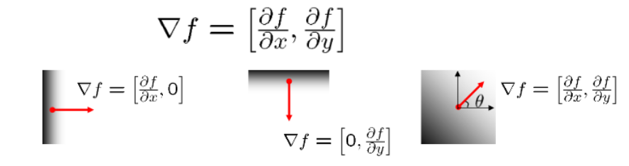
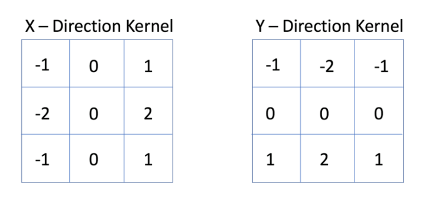
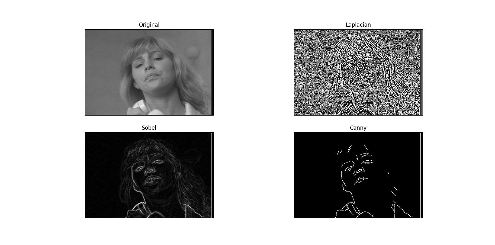

# Edge Detection

## Objective

The purpose of this paper is to include details on edge detection in image processing. We're going to look at what edges are, why we need to remove edges, and how we can do it using different methods.

## What are edges?

Type of edges:

- Horizontal edges
- Vertical edges
- Diagonal edges

## Why detecting edges

For several reasons: 

The main idea of why we detect edges is to catch the most interesting events or modifications in an image. Since edges are more compact than pixels, we use them to distinguish objects, fit images or analyze images, and so on.

## How to detect edges

Edges come from:

- Surface normal discontinuity
- Depth discontinuity
- Surface color discontinuity
- Illumination discontinuity
 
We can produce a sub-image by applying edge detectors containing a series of related curves showing the borders of the objects, hence the key events in an image . In addition, we can also decrease the amount of redundant data to be processed and filter out any information that is unrelated to the operation. 

Still, there are many variables in an image which makes getting the ideal edges a complicated process. Many methods are available for extraction, each with their own pros and cons

### 1. Image gradient
Image gradient is nothing but directional shifts in images' intensity. This method can help us detect the edge by measuring the gradient in a small image region and then repeating the procedure over and over again. The gradient of an image can be interpreted as a function:



Edge strength:

$$ || \triangledown f || = \sqrt{(\frac{\partial f}{\partial x})^2 + (\frac{\partial f}{\partial y})^2 } $$

The arrows indicate the most rapid increase in intensity. 

Angle calculation:

$$ \space \theta = tan^{-1} * (\frac{\partial f}{\partial x} / \frac{\partial f}{\partial y})  $$


Each estimation is performed in a small area of the image and once all regions have been calculated, we need to keep replicating this procedure. Variations have been produced on the basis of this approach to increase the efficacy of detections, minimizing the amount of workloads.


### 2. Sobel operator

The Sober operator, invented by Irwin Sobel and Gary Feldman, uses two 3x3 matrix each for x and y direction to calculate derivative of an image. By placing the gradient matrix over each pixel of an image, it is possible to find the amount of differences. 



By putting the gradient matrix over each pixel of an image, the point is to find the number of differences. It isn't the best options, but since measurement can be performed easily, it can also be a very helpful solution.

### 3. Canny edge detection

The Canny edge detector, invented by John F. Canny in 1986, is an operator that uses a multi-stage algorithm to classify edges. The method can usually be broken down into 5 key steps: 

1.  Smoothing: Smooth the image with a Gaussian filter with spread σ
2.  Gradient: Compute gradient magnitude and direction at each pixel of the smoothed image
3.  Thresholding: Threshold the gradient magnitude image such that strong edges are kept and noise is suppressed
4.  Non-maximum suppression (thinning): Zero out all pixels that are not the maximum along the direction of the gradient (look at 1 pixel on each side)
5.  Tracing edges: Trace high-magnitude contours and keep only pixels along these contours, so weak little segments go away


### 4. Practical Code

```python
import sys
import numpy as np
import cv2
from matplotlib import pyplot as plt

img = cv2.imread("../SHARED_DigitalForensics/Labworks/LabWork_2/susie.png", cv2.IMREAD_COLOR)

laplacian = cv2.Laplacian(img,cv2.CV_64F)
canny = cv2.Canny(img, 100, 200)

#SOBEL
scale = 1
delta = 0
ddepth = cv2.CV_16S
gray = cv2.cvtColor(img, cv2.COLOR_BGR2GRAY)
grad_x = cv2.Sobel(gray, ddepth, 1, 0, ksize=3, scale=scale, delta=delta, borderType=cv2.BORDER_DEFAULT)
grad_y = cv2.Sobel(gray, ddepth, 0, 1, ksize=3, scale=scale, delta=delta, borderType=cv2.BORDER_DEFAULT)
abs_grad_x = cv2.convertScaleAbs(grad_x)
abs_grad_y = cv2.convertScaleAbs(grad_y)
sobel = cv2.addWeighted(abs_grad_x, 0.5, abs_grad_y, 0.5, 0)

plt.subplot(2,2,1),plt.imshow(img,cmap = 'gray')
plt.title('Original'), plt.xticks([]), plt.yticks([])
plt.subplot(2,2,2),plt.imshow(laplacian,cmap = 'gray')
plt.title('Laplacian'), plt.xticks([]), plt.yticks([])
plt.subplot(2,2,3),plt.imshow(sobel,cmap = 'gray')
plt.title('Sobel'), plt.xticks([]), plt.yticks([])
plt.subplot(2,2,4),plt.imshow(canny,cmap = 'gray')
plt.title('Canny'), plt.xticks([]), plt.yticks([])

plt.show()
```

### 5.Results

