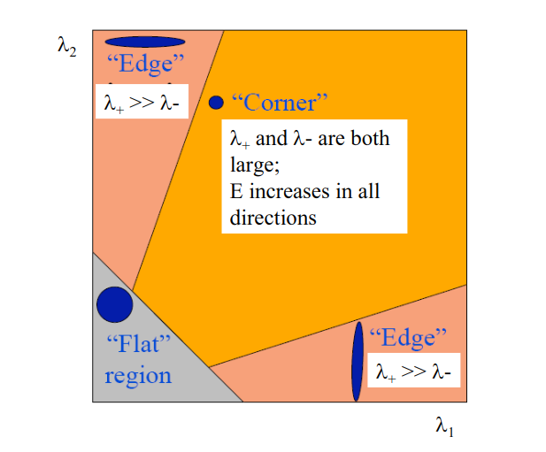
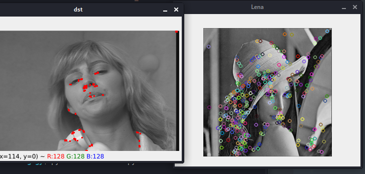
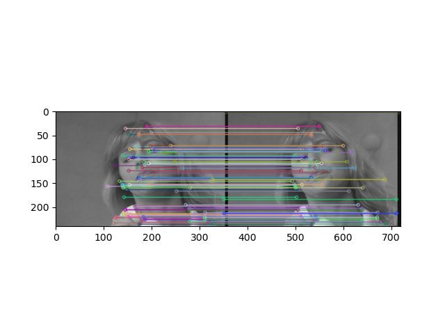

# Feature and Image Matching

## **What are features?**
Image features, such as edges and interest points, provide rich information on
the image content. They correspond to local regions in the image and are fundamental in many applications in image analysis: recognition, matching, reconstruction, etc. 

Image features yield two different types of problem: 
- The detection of area of interest in the image, typically contours
- The description of local regions in the image, typically for matching in different images. 

In any case, they relate to the differential properties of the intensity function, for instance the gradient or the laplacian that are used to detect intensity discontinuities that occur at contours.

## **Types of features:**

### Edges
Edges are points where two image regions have a border (or an edge) separating them. An edge may usually be almost random in shape, and can have junctions. Edges are generally defined in practice as sets of points that have a strong gradient magnitude in the picture. In addition, to form a more complete definition of an edge, several common algorithms can then chain high gradient points together. Typically, these algorithms impose certain restrictions on an edge's properties, such as form, smoothness, and importance of gradient. 

Locally, there is a one-dimensional arrangement of edges.

### Corners / interest points

In an image, which has a local two-dimensional structure, the terms corners and interest points are used somewhat interchangeably and refer to point-like features. Since early algorithms first performed edge detection, the term "Corner" emerged, and then studied the edges to find fast shifts in direction (corners). These algorithms were then developed such that explicit edge detection, for example by searching for high levels of curvature in the gradient of the image, was no longer necessary.

### Blobs
As compared to corners that are more point-like, blobs offer a complementary definition of image structures in terms of regions. Nevertheless a desired point (a local limit of an operator reaction or a center of gravity) can also be found in blob descriptors, meaning that certain blob detectors may often be considered as operators of interest points. Blob detectors are able to identify regions in an image that are too smooth for a corner detector to detect.

Consider reducing a picture and then conducting identification of corners. The detector will react to points in the shrunk image that are sharp, but may be smooth in the original image. The distinction between a corner detector and a blob detector becomes very unclear at this point. To a significant degree, by including an acceptable notion of size, this distinction may be remedied.

### Ridges
The notion of ridges is a natural tool for elongated objects. It is possible to see a ridge descriptor determined from a grey-level picture as a medial axis generalization. A ridge can be considered as a one-dimensional curve from a functional point of view, and represents an axis of symmetry, and therefore has a local ridge width attribute associated with each ridge point. However, it is algorithmically more difficult than edge, corner or blob features to remove ridge features from general classes of gray-level photos. Nevertheless, ridge descriptors are also used in aerial photos for road extraction and surgical images for the extraction of blood vessels-see ridge identification.

## **Why features?** 

Having knowledge about features can help us carry out the following tasks:

I. Matching image patches between images with significantly different viewpoints

II. Extracting image landmarks; a) their (x, y) position,

III. Extracting image landmarks; b) their scale, and c) their orientation.

Once features have been detected, a local image patch around the feature can be extracted. This extraction may involve quite considerable amounts of image processing. 

These distinct features then can be used for:

- Image alignment (e.g., panoramic mosaics)
- Object recognitio
- 3D reconstruction (e.g., stereo)
- Motion tracking
- Indexing and content-based retrieve
- Robot navigation

## **Feature detection**

General method to detect features:

1. Define SSD (Sum Squared Differences):

$$ E(u,v) = \sum_{x,y} w(x,y)[I(x+u,y+v)-I(x,y)]^2 \space (1) $$ 
    u, v: x, y coordinates of every pixel in 3x3 window.
    I: the intensity value of the pixel.

2. Plugging small motion assumption into (1) we have:
   
$$ E(u,v) \approx [I_x \space I_y] [{u \atop v}]^2 \space (2)$$

3. (2) can be written as:

$$ E(u,v) \approx [u \space \space v](\sum[{I_x^2 \atop I_xI_y} I_xI_y])[{u \atop v}] (3)$$

4. Finding the direction that result in the largest and smallest E values:

- Find x by solving:

$$ E(u,v) \approx [u \space \space v] M [{u \atop v}] $$

- With


$$ \lambda \pm = \frac{1}{2}[(h_{11} + h_{22} \pm \sqrt{4h_{12}h_{21} + (h_{11} - h_{22})^2}$$

- Capture shifts with the smallest and largest change (E value):

  - $$ x_+ = direction \space of \space largest \space increase \space in \space E $$  
  - $$ \lambda_+ = amount \space of \space increase \space in \space direction \space x_+ $$
  - $$ x_- = direction \space of \space smallest \space increase \space in \space E $$
  - $$ \lambda_+ = amount \space of \space increase \space in \space direction \space x_- $$

- These features are then used for feature detections:
  
    

For E(u,v) to be large in all directions:
- the minimum of E(u,v)should be large over all unit vectors [u v]
- this minimum is given by the smaller eigenvalue λ- of H
- Look for large values of λ-

In summary, the 5 steps to detect feature are:

Here’s what you do:
- Compute the gradient at each point in the image
- Create the Hmatrix from the entries in the gradient
- Compute the eigenvalues. 
- Find points with large response (λ -> threshold)
- Choose those points where λ-is a local maximum as features (interest points)


### The Harris Operator:

Using the above value for lambda, we can find the Harris Corner Detector:

$$ f_{Harris} = \lambda_+ \lambda_- - k(\lambda_+  + \lambda_-)^2 = (h_{11}h_{22} - h_{12}h_{21}) - k(h_{11} + h_{22})^2  = det(H) - ktrace(H)^2 $$

Looking for corners using Harris Operator:
- Find scale that gives local maximum of Harris Operator
- Generate copies of image at multiple scales by convolving with Gaussians of different σ and using a pyramid
- Find local maxima points by comparing to neighboring points at current and adjacent scales
- Each interest point is a local maximum in both position and scale 

### Feature Discriptor:

A feature descriptor is an algorithm which takes an image and outputs feature descriptors/feature vectors. Feature descriptors encode interesting information into a series of numbers and act as a sort of numerical "fingerprint" that can be used to differentiate one feature from another. Ideally this information would be invariant under image transformation, so we can find the feature again even if the image is transformed in some way. An example would be SIFT, which encodes information about the local neighbourhood image gradients the numbers of the feature vector.

### Scale Invariant Feature Transform (SIFT):

SIFT has the property of scale invariance, which makes it better than Harris. Harris is not scale-invariant, a corner may become an edge if the scale changes, as shown in the following image.

Harris is not scale-invariant. So what is scale, and what does scale invariance mean?

The scale of an image landmark is its (rough) diameter in the image. It is denoted by σ, which is measured in pixels, you can think scale invariance as that we can detect similar landmarks even if their scale is different.

SIFT achieves Scale Invariance by:

- Taking 16x16 square window around detected interest point 
- Compute edge orientation (angle of the gradient minus 90°) for each pixel
- Throw out weak edges (threshold gradient magnitude)
- Create histogram of surviving edge orientations (8 bins)

Use SIFT because the algorithm:
- Has extraordinarily robust matching technique
- Can handle changes in viewpoint
- Up to about 60 degree out of plane rotation
- Can handle significant changes in illumination: Sometimes even day vs. night (below)
- Fast and efficient—can run in real time
- Lots of code available: http://people.csail.mit.edu/albert/ladypack/wiki/index.php/Known_implementations_of_SIFT


## Image Matching:

Image matching is a technique in digital image processing for finding small parts of an image which match a template image. It can be used in manufacturing as a part of quality control, a way to navigate a mobile robot, or as a way to detect edges in images.

## Practical Code:

### Feature Detection:
```python
import cv2
import numpy as np
from matplotlib import pyplot as pyplot

#Harris Corner Detection
susie = cv2.imread("../SHARED_DigitalForensics/Labworks/LabWork_2/susie.png")
gray = cv2.cvtColor(susie,cv2.COLOR_BGR2GRAY)

gray = np.float32(gray)
dst = cv2.cornerHarris(gray,2,3,0.04)

dst = cv2.dilate(dst,None)
susie[dst>0.01*dst.max()]=[0,0,255]

cv2.imshow('dst',susie)

#SIFT:
lena = cv2.imread("../SHARED_DigitalForensics/Labworks/LabWork_2/lena.png")
gray2 = cv2.cvtColor(lena, cv2.COLOR_BGR2GRAY)
sift = cv2.SIFT_create()
kp = sift.detect(lena, None)
lena2 = cv2.drawKeypoints(gray2, kp, lena)
cv2.imshow("Lena", lena)

key = cv2.waitKey(0)
if key == ord("q"):    
    sys.exit(0)
```

Results:



### Feature Matching:
```python
import cv2
import numpy as np
from matplotlib import pyplot as plt

#Harris Corner Detection
susie1 = cv2.imread("../SHARED_DigitalForensics/Labworks/LabWork_2/susie.png", 0)
susie2 = cv2.imread("../SHARED_DigitalForensics/Labworks/LabWork_2/susie.png", 0)

# Initiate SIFT detector
sift = cv2.SIFT_create()

# find the keypoints and descriptors with SIFT
kp1, des1 = sift.detectAndCompute(susie1,None)
kp2, des2 = sift.detectAndCompute(susie2,None)

# BFMatcher with default params
bf = cv2.BFMatcher()
matches = bf.knnMatch(des1,des2, k=2)

# Apply ratio test
good = []
for m,n in matches:
    if m.distance < 0.75*n.distance:
        good.append([m])

# cv2.drawMatchesKnn expects list of lists as matches.
img3 = cv2.drawMatchesKnn(susie1,kp1,susie2,kp2,good,None,flags=cv2.DrawMatchesFlags_NOT_DRAW_SINGLE_POINTS)

plt.imshow(img3),plt.show()
```

Results:
