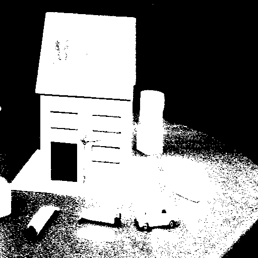
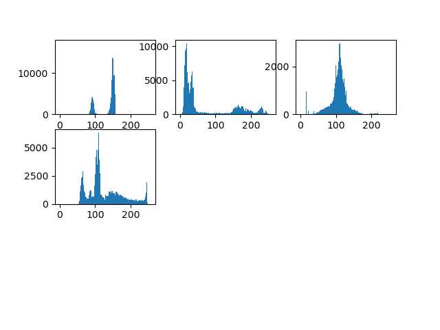

# Bachelor 3 - CS - 2020/2021
## Digital Forensics
### Labwork 3
#### Name: Nguyen Duc Anh
#### ID: BI9-041

##### **I. Binarization**

**1. Arbitrary threshold:**

For all of the images below, ARBITRARILY determine a binarization threshold and assess the 
difficulty in applying the thresholding operation. Arbitrarily means that the choice is based by looking at the image (pixels intensity) only 

- First category of images: 

- Second category of images: 

Conclude on this technique for choosing the threshold.

**Solution:**
The code for this section is at: **arbitrary_threshold.py**
- Choosing arbitrarily threshold: 200/255

Here are the images after choosing the threshold as 200: 

Choosing such threshold in a random manner results in low-quality images, we have to adjust the threshold values to around 127 to get good results. We have to put a lot of efforts into the adjusting the value.   

**2. Threshold with the histogram:**

Using the histogram, determine the threshold that you think is optimal for the same images as above.
With the same method binarize the image .
- What do you observe? 
- Why ?
- Conclusions on the ease (or difficulty) to binarize an image, that is to say to separate the substance from the form?

**Solution:**
The code for this section is at: **histogram_threshold.py**
- Histogram: 

The way I am going to choose the threshold is using Histogram Peak Technique. I want to find the two peaks in the histogram corresponding to the background and object of the image. Then I set the threshold value automatically halfway between the two peaks.

- Forme1: 125
- House8: 100
- Woman: 60
- Forme3: 80